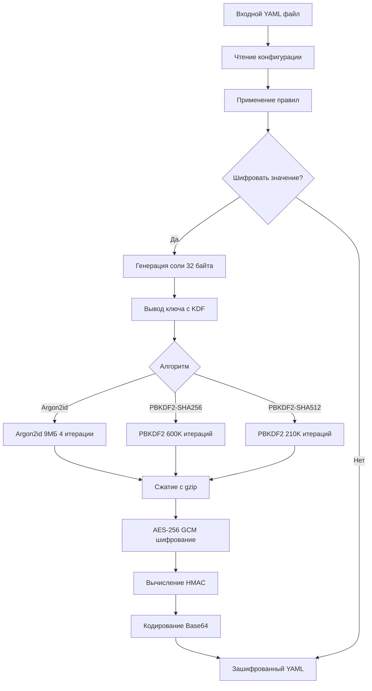
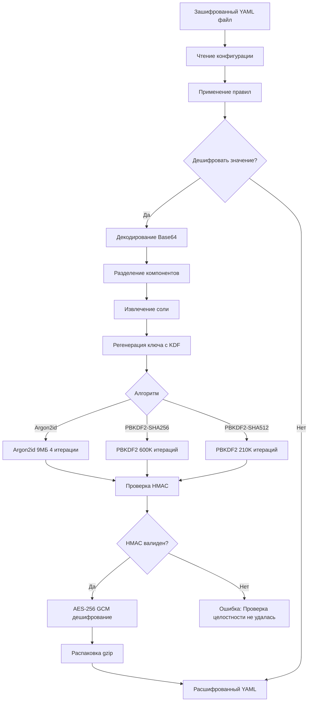
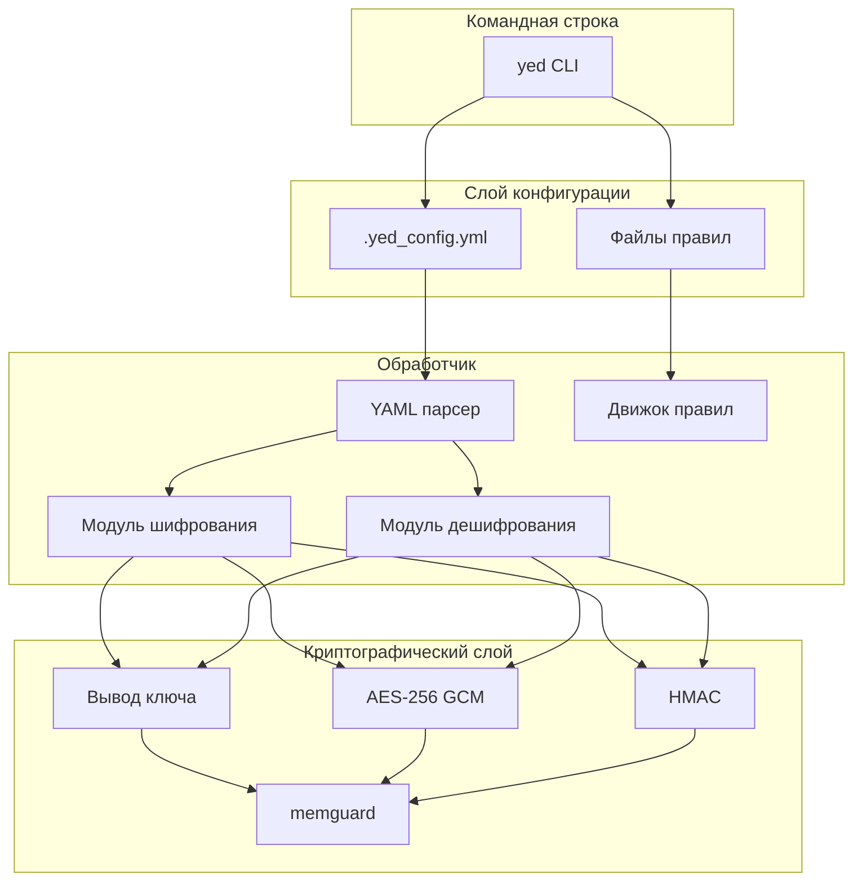
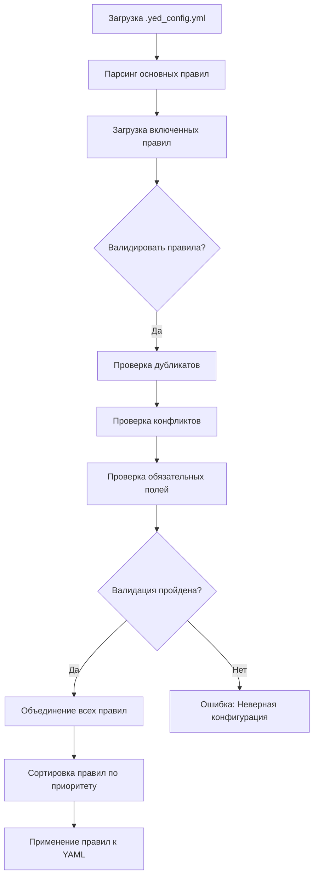
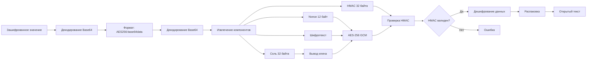
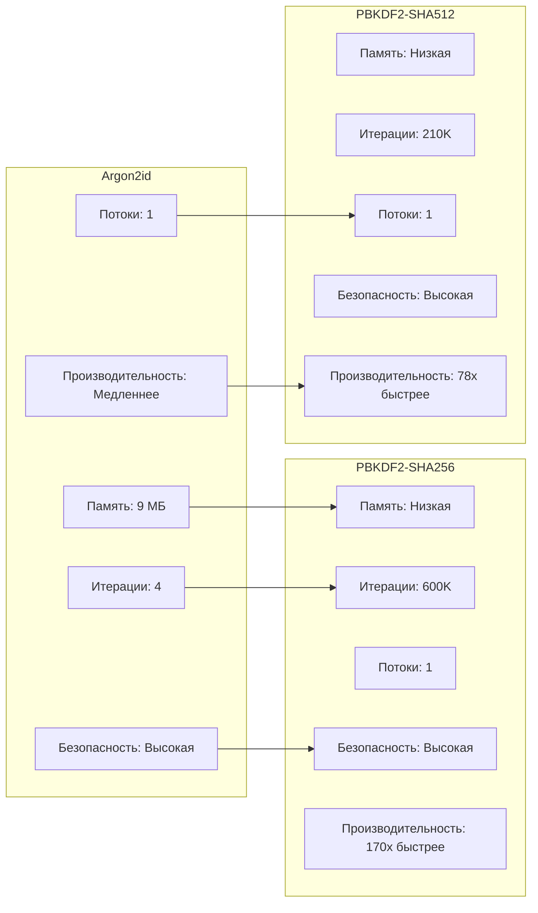
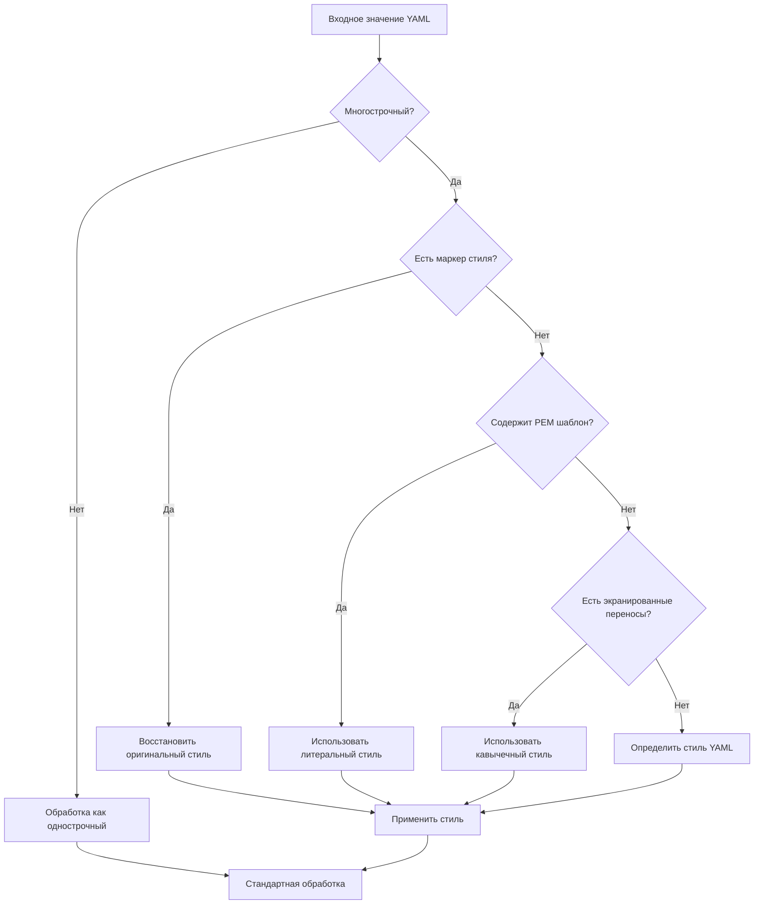
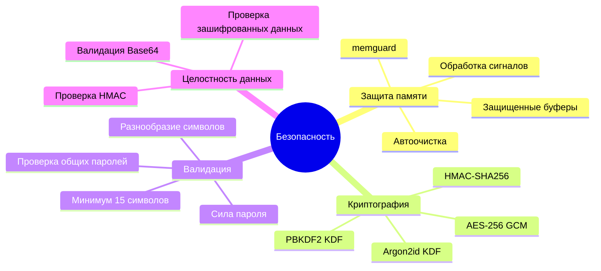

# YAML Encrypter-Decrypter (`yed`)

 [](https://hub.docker.com/r/zetfolder17/yaml-encrypter-decrypter)  [](https://github.com/Gosayram/yaml-encrypter-decrypter/actions/workflows/ci-go-lint.yml) [](https://github.com/Gosayram/yaml-encrypter-decrypter/graphs/contributors/) [](https://goreportcard.com/report/github.com/Gosayram/yaml-encrypter-decrypter) [](https://securityscorecards.dev/viewer/?uri=github.com/Gosayram/yaml-encrypter-decrypter)  [](https://github.com/Gosayram/yaml-encrypter-decrypter/blob/main/LICENSE) [](https://github.com/Gosayram/yaml-encrypter-decrypter/actions/workflows/codeql.yml)*

*CLI-инструмент на Go для шифрования и дешифрования конфиденциальных данных в YAML файлах. Использует современные алгоритмы шифрования и надежную систему конфигурации для обеспечения безопасной обработки данных.*

Кросс-платформенная утилита для шифрования/дешифрования значений конфиденциальных данных в YAML файлах.

Утилита особенно актуальна для разработчиков, которые не могут использовать Hashicorp Vault или SOPS, но не хотят хранить конфиденциальные данные в Git репозитории.

## **Возможности**
- Шифрование AES-256 GCM для обеспечения конфиденциальности и целостности данных.
- Несколько алгоритмов формирования ключа:
  - Argon2id (по умолчанию) с параметрами, рекомендованными OWASP
  - PBKDF2-SHA256 (совместимый с NIST/FIPS) с 600,000 итераций
  - PBKDF2-SHA512 (совместимый с NIST/FIPS) с 210,000 итераций
- Поддержка всех форматов многострочного YAML:
  - Литеральный стиль (|) с сохранением переносов строк
  - Свернутый стиль (>) для однострочного отображения с пробелами
  - PEM сертификаты/ключи в обоих форматах (многострочный литеральный и с экранированными переносами строк)
- Безопасная обработка памяти с использованием memguard для защиты конфиденциальных данных в памяти.
- HMAC для проверки целостности данных.
- Сжатие с использованием gzip для оптимизации хранения данных.
- Улучшенная система управления правилами:
  - Поддержка включения файлов правил с подстановочными знаками и диапазонами (например, `rules[1-3].yml`)
  - Автоматическая валидация правил для предотвращения конфликтов и дубликатов
  - Настраиваемая валидация правил через настройку `validate_rules`
  - Улучшенные сообщения об ошибках с ссылками на номера строк для конфликтов правил
  - Поддержка как абсолютных, так и относительных путей при включении правил
- Улучшенная логика сопоставления правил:
  - Правильная оценка пути с приоритетом блока для более точного применения правил
  - Точный контроль над тем, какие пути должны быть исключены из шифрования
  - Исправление глобального сопоставления шаблонов для учета спецификаций блока
- Поддержка кросс-платформенной сборки (Linux, macOS, Windows).
- Комплексный Makefile для сборки, тестирования и запуска проекта.
- Улучшенная валидация зашифрованных данных и base64 строк.
- Улучшенная обработка ошибок и расширенное логирование отладки.
- Комплексное тестовое покрытие с race detection.
- Бенчмарки для операций шифрования/дешифрования.
- Обновленные требования к паролю в соответствии с NIST SP 800-63B:
  - Минимальная длина пароля увеличена до 15 символов
  - Максимальная длина пароля остается 64 символа
- Улучшенное форматирование вывода справки с четкой категоризацией опций.
- Улучшенная поддержка многострочного YAML с сохранением стиля
- Улучшенная обработка безопасной памяти с оптимизированным управлением буферами
- Улучшенный расчет HMAC для лучшей целостности данных
- Оптимизированная обработка данных с уменьшением количества защищенных копий
- Упрощенная логика сжатия данных
- Разделенный подход для алгоритма шифрования и параметров
- Улучшенная структура кода и удобство сопровождения
- Улучшенная отладочная информация с подробными комментариями по этапам
- Добавлены возможности ручного тестирования через Makefile
- Добавлены простые аргументы для сборки и запуска Docker
- Добавлены новые тестовые файлы для многострочных параметров
- Добавлены аргументы бенчмарков в консольный вывод
- Добавлена функция cleanerEncrypted для непечатаемых строк
- Улучшенное тестовое покрытие для processing.go

## **Последние обновления**
- **Управление правилами**: Улучшенная система правил с поддержкой включенных файлов правил, подстановочных знаков, диапазонов и валидации
- **Обработка ошибок**: Улучшенные сообщения об ошибках с информацией о путях и деталях конфликтов правил
- **Модульный дизайн**: Рефакторинг системы загрузки правил для лучшей сопровождаемости и расширяемости
- **Обработка правил**: Добавлена поддержка модульных файлов правил и улучшенная валидация конфигураций правил
- **Улучшение шифрования**: Обновлена обработка ошибок дешифрования с лучшей контекстной информацией
- **Качество кода**: Рефакторинг функций для улучшения модульности и лучшего модульного тестирования
- **Улучшение безопасности**: Увеличена минимальная длина пароля до 15 символов для соответствия рекомендациям NIST SP 800-63B
- **Улучшение UI**: Реорганизован вывод справки для лучшей читаемости и ясности
- **Документация**: Обновлена вся документация для отражения новых требований безопасности
- **Качество кода**: Исправлены различные предупреждения линтера и улучшена документация кода
- **Безопасность**: Улучшено использование безопасной памяти для зашифрованного мастер-ключа
- **Производительность**: Улучшен расчет HMAC для всех блоков данных
- **Тестирование**: Добавлено комплексное тестовое покрытие для processing.go
- **Docker**: Добавлены упрощенные аргументы для сборки и запуска Docker
- **Отладка**: Добавлена улучшенная отладочная информация с подробными комментариями по этапам
- **Тестирование**: Добавлены возможности ручного тестирования через Makefile
- **Поддержка многострочного**: Добавлены новые тестовые файлы для многострочных параметров
- **Бенчмаркинг**: Добавлены аргументы бенчмарков в консольный вывод
- **Обработка строк**: Добавлена функция cleanerEncrypted для непечатаемых строк

## **Результаты тестирования производительности**

Производительность различных алгоритмов формирования ключа была тщательно протестирована, чтобы помочь вам сделать обоснованный выбор в зависимости от ваших требований безопасности и производительности.

### **Сравнение алгоритмов формирования ключа**

| Алгоритм | Операций/сек | Время (нс/оп) | Память (Б/оп) | Аллокаций/оп |
|-----------|----------------|--------------|---------------|-----------|
| Argon2id | 60 | 18,363,235 | 9,442,344 | 49 |
| PBKDF2-SHA256 | 10,000 | 107,746 | 804 | 11 |
| PBKDF2-SHA512 | 4,830 | 236,775 | 1,380 | 11 |

**Ключевые выводы:**
- **PBKDF2-SHA256** примерно в **170 раз быстрее**, чем Argon2id
- **PBKDF2-SHA512** примерно в **78 раз быстрее**, чем Argon2id
- Оба варианта PBKDF2 используют значительно меньше памяти, чем Argon2id
- Алгоритмы PBKDF2 настроены с достаточным количеством итераций для обеспечения эквивалентной безопасности

### **Сравнение конфигураций Argon2**

| Конфигурация | Операций/сек | Время (нс/оп) | Память (Б/оп) | Аллокаций/оп |
|--------------|----------------|--------------|---------------|-----------|
| OWASP-1-текущая | 67 | 17,818,289 | 9,442,306 | 48 |
| OWASP-2 | 70 | 17,125,754 | 7,345,429 | 56 |
| OWASP-3 | 67 | 17,846,443 | 12,587,776 | 40 |
| Предыдущая-конфигурация | 8 | 138,691,224 | 268,457,400 | 198 |

**Ключевые улучшения:**
- Текущая конфигурация, рекомендованная OWASP, примерно в **8 раз быстрее** предыдущей конфигурации
- Использование памяти уменьшено примерно в **27 раз** при сохранении безопасности
- Все конфигурации, рекомендованные OWASP, обеспечивают сходную производительность с разными компромиссами по памяти/итерациям

### **Базовая производительность шифрования и дешифрования**

| Операция | Операций/сек | Время (нс/оп) | Память (Б/оп) | Аллокаций/оп |
|-----------|----------------|--------------|---------------|-----------|
| Шифрование | 66 | 17,791,645 | 10,260,991 | 88 |
| Дешифрование | 67 | 19,369,065 | 9,490,663 | 71 |

### **Шифрование с разными алгоритмами**

| Алгоритм | Операций/сек | Время (нс/оп) | Память (Б/оп) | Аллокаций/оп |
|-----------|----------------|--------------|---------------|-----------|
| argon2id | 61 | 19,897,308 | 10,259,454 | 89 |
| pbkdf2-sha256 | 6,548 | 191,538 | 817,917 | 51 |
| pbkdf2-sha512 | 3,604 | 340,094 | 818,493 | 51 |

### **Дешифрование с разными алгоритмами**

| Алгоритм | Операций/сек | Время (нс/оп) | Память (Б/оп) | Аллокаций/оп |
|-----------|----------------|--------------|---------------|-----------|
| argon2id | 61 | 20,304,921 | 9,486,333 | 68 |
| pbkdf2-sha256 | 7,838 | 160,589 | 44,796 | 30 |
| pbkdf2-sha512 | 3,909 | 313,596 | 45,372 | 30 |

> [!NOTE]
> Эти тесты производительности были выполнены на процессоре Apple M3 Pro. Производительность может различаться в зависимости от оборудования.

Вы можете сгенерировать отчеты по производительности для вашей системы с помощью:
```bash
make benchmark-report
```

---

## **Как это работает**

### **Процесс шифрования**



### **Шифрование**
1. Предоставленный открытый текст сжимается с помощью `gzip` для уменьшения размера.
2. Генерируется случайная **соль** (32 байта) для обеспечения уникальности шифрования даже при одинаковом пароле.
3. Пароль преобразуется в криптографический ключ с помощью одного из следующих алгоритмов:
   - **Argon2id** (по умолчанию, рекомендации OWASP):
     - **Память**: 9 МБ (9216 KiБ)
     - **Итерации**: 4
     - **Потоки**: 1
   - **PBKDF2-SHA256** (опционально, совместимо с NIST/FIPS):
     - **Итерации**: 600,000
   - **PBKDF2-SHA512** (опционально, совместимо с NIST/FIPS):
     - **Итерации**: 210,000
4. Открытый текст шифруется с помощью **AES-256 GCM** (128-битный nonce, 256-битный ключ) для обеспечения конфиденциальности и целостности.
5. Вычисляется **HMAC** для проверки целостности зашифрованных данных.
6. Конечный результат объединяет соль, nonce, зашифрованные данные и HMAC.

### **Безопасная обработка памяти**
Инструмент реализует надежные меры безопасности памяти для защиты конфиденциальных данных:

1. **Защищенные буферы памяти**: Использует memguard для создания защищенных анклавов памяти для конфиденциальных данных.
2. **Защита памяти**: Память, содержащая конфиденциальные данные, защищена от выгрузки на диск.
3. **Автоматическая очистка**: Все защищенные буферы автоматически уничтожаются после использования.
4. **Обработка сигналов**: Правильно обрабатывает сигналы прерывания, чтобы гарантировать удаление конфиденциальных данных из памяти.
5. **Жизненный цикл буфера**: Управление жизненным циклом буфера с явными вызовами уничтожения для предотвращения утечек памяти.
6. **Защита конфиденциальных данных**: Предотвращает попадание конфиденциальных данных в логи или сообщения об ошибках.
7. **Сильные требования к паролям**: Обеспечивает минимальную длину ключа 15 символов (совместимо с NIST SP 800-63B) для ключей, предоставленных через командную строку и переменные окружения.
8. **Оптимизированное использование памяти**: Улучшенное использование безопасной памяти с фокусом на критические компоненты
9. **Улучшенный HMAC**: Улучшенный расчет HMAC для лучшей целостности данных
10. **Управление буферами**: Оптимизированная обработка данных с уменьшением количества защищенных копий
11. **Сжатие**: Упрощенная логика сжатия данных для лучшей производительности
12. **Разделение алгоритмов**: Разделенный подход для алгоритма шифрования и параметров

### **Поддержка многострочного YAML**
Инструмент обеспечивает комплексную поддержку шифрования и дешифрования многострочного содержимого YAML:

1. **Обнаружение формата**: Автоматически обнаруживает многострочное содержимое путем анализа стиля узла YAML и содержимого.
2. **Сохранение стиля**: Сохраняет оригинальные стили многострочного YAML (литеральный `|` или свернутый `>`) при шифровании/дешифровании.
3. **Поддержка PEM**: Специальная обработка PEM сертификатов и приватных ключей в обоих форматах:
   - Многострочные литеральные блоки с сохранением переносов строк
   - Однострочные строки с экранированными переносами строк (`\n`)
4. **Умное форматирование**: Применяет соответствующий стиль при дешифровании на основе типа содержимого:
   - Содержимое PEM использует литеральный стиль для сохранения точного форматирования
   - Содержимое с табуляциями использует литеральный стиль для правильного представления
   - Многострочное содержимое форматируется в соответствии с его оригинальным стилем когда возможно
5. **Бесшовная работа**: Никакой специальной конфигурации не нужно - многострочная обработка работает автоматически.

#### **Примеры многострочного шифрования**

<details>
<summary>Нажмите, чтобы развернуть примеры многострочного шифрования</summary>

**Оригинальный YAML с многострочным содержимым:**
```yaml
# Пример с различными форматами многострочного
smart_config:
  auth:
    # Литеральный стиль - сохраняет переносы строк
    password: |
      ThisIsAVery
      LongPassword
      WithMultipleLines
    # Свернутый стиль - преобразуется в пробелы
    description: >
      This is a folded text
      that will be rendered as
      a single line with spaces.

certificates:
  # Многострочный литеральный блок для сертификатов
  public_key: |
    -----BEGIN PUBLIC KEY-----
    MIIBIjANBgkqhkiG9w0BAQEFAAOCAQ8AMIIBCgKCAQEAxWzg9vJJR0TIIu5XzCQG
    BijxB+EFPYvkJ/3vbXFNaYQTvMPwcU3I9JXaUFwIHHjMnHElo6oHECBZzj5ki9Dg
    3l1FcJn598L0D0pLECZ9wOJeGHlPP/CGXj6gWVj6kfn3t/9I4hQ7oz5X+JzmqGEg
    /JyqVVZ1BqHd09jrLQIDAQAB
    -----END PUBLIC KEY-----
  
  # Сертификат с экранированными переносами строк (кавычечный стиль)
  quoted_public_key: "-----BEGIN PUBLIC KEY-----\nMIIBIjANBgkqhkiG9w0BAQEFAAOCAQ8AMIIBCgKCAQEA\nxWzg9vJJR0TIIu5XzCQG\n-----END PUBLIC KEY-----"
```

**После шифрования:**
```yaml
# Пример с различными форматами многострочного
smart_config:
  auth:
    # Зашифрованный литеральный стиль - будет дешифрован с сохранением переносов строк
    password: AES256:YXJnb24yaWQAAAAAAAAAm+G/h4Mwe5pHQvCxKvS7d2QfcO7N5iUVwVr0BIQ2+eXxPU7KqJMbM5BFnl2i3RiG2LQdKQpWnpxr8WctL3/l83acdTUdqq5YwJLZeWKwxW0qFMJHuGFgxJVJ8CpnFZFOeewVbUoS/oqbjNR9lGqF9I6E/8FJOp/QZUR4VTKxWICMUBeTJBOlf9JHtNJlzeFsQVKQ/Z2PNDvgjfYI0GJ7y5Ry/vdjdXVEDvlKwKTiXBQXvWf8rL7L/T2N9eOiGxZ6iRV+oM8hqQ==
    # Зашифрованный свернутый стиль - будет дешифрован с сохранением пробелов
    description: AES256:YXJnb24yaWQAAAAAAAAAAl5gR1X7uPMikY8sQZP2YjJ8X7ixOu2cY5nAHIMTnxvILrI+Q2FTXxV9wTSOvbTQDlpHmcTCshpfYX3qRYMUBt5FRNtAqeRQxP/5R0zLi0Gg56i/vsDdLRkDXU32T9cAoUHcHN5oOy87tpSWnhrkwp3pzZ9UPPwZsOuOoEP+GDWoRsxNaNKKD7FaXNXRyKqZcQlcHcgVMPtUBx19SrGfE/rVmtO2QzWQl4YLCVXpgMZ4N5A7lZ9zslDFTIzImKUuHC8vWCPcOkTpIgFElhCDz5i0M9hB

certificates:
  # Зашифрованный сертификат - будет дешифрован как литеральный блок
  public_key: AES256:YXJnb24yaWQAAAAAAAAAAEUpnFVVS1KZtHZwUWwsaAiFQhszeEM6aYwEJrWvFLMtOozIpcKcyBs0utUs9gvoAaAsiQzCF+ow/hmobI8ghjmo23Aq4hwX9ZzUIo47MeSNsISGtz2R6PBl0mvwLUOp9RARj3U5/RDS1tC7N7qnTpesvVUlt3gDYc2hPhJEauJEekZm9wd6Z26NJTWQKREFi8/ZtzIkPp5/ie+sOFSmWXdajSunYgKk1iBYFhohsv9ULkrCSQke/s1wT9qbDA3HwPyCJ3LdJdE78c+uMRa17Acvi/W/kyFAD3pKliSBWE6ZNc41JGiNAzZ2KpVmOMY6SeYYP/AxBPNfKwgdyHDCyrwf8dIFMNVr6NItbm8D6QhkgA++L0XkksrvbWa8cG+8KwIK75IrP1w4xhYvuRS0qraBVhJIQMu05+0SGNbfmYpSWZJJpDA8hQVBQepPWrxilBg9XiHIvOM84ykVIS6z7InyPwn+sEhcagQUA4NKBiAE6yXT3sV8khhqeM8imsgCjd+8PTDWJDXYyees8LVnQrQWPWBL5lGIQvfBwY7D/vinHvHNCMRCIbbcUD8n9Rk1RWXnz5yaCcZiAd1TNYYlpgya44cIASUVPSzotvKBaYG4a9Wxe3XTmgwkqYwSg0Y7QuRlSeTo8oE=
  
  # Зашифрованный кавычечный сертификат - будет дешифрован с экранированными переносами строк
  quoted_public_key: AES256:YXJnb24yaWQAAAAAAAAAAMsXrCK7X+pgKU8J8C23ns+ubKW/LzFpi0GUcJFMJWgqnHc6RlQhmLuwVtQmvNBwA1C+2is/IjRfnipRdqzMEXz/ULSwMB+H9u2MTHXnXCFjn0wUc1pw0I/9xCVk8yXYVueaCO8kdyFExrTHpT8VfbsQqxKHZ/sEJ4WZIszaHpjkL8rbVKaJxl7hgHXdL1Q3D9oRQ9q/3MOXCLsWj1EPu1bNOQueDdgJTeozKErJGaHQsUB/1ODeiVmjKVlePxdKOlmIsLMCqo0vGx8elvRii3cdnfmCDnz5iT9z6VuYFxDXLtbWSWa41jQMaHMhwW7NnGJEFBzIGr+/yE9+qEqu9VMs4kFA79PRB1vPDVL+SZn62ewg6mbr6992uUJBn6AvtM4RsciQzzR5iE6WcFRer/7ZhfVMcCd27KRNS/X6i+jqzdnFmNLh+wPekApozwcvPPfcLbXtYRE52kNgqaN7/QQjup6EAPgRLB/qW+dAz5CCfGfCwzmAtKV3yiHgeZxwoy9E6YAyqJtmsUamUwkaW/6jA8airYzQ7zdEp15QKLGUDYF3n2OpvhRgwGWfiPfC0TRFmTRFpA4fimzFKkwAad1FKqBcH87HtyVfwgF38NZsPxkC2jqZ44mMcFf4v1f9w/aF4pZ65Q==|escaped_newlines
```

**После дешифрования (возврат к оригинальному содержимому с сохранением стилей):**
```yaml
# Пример с различными форматами многострочного
smart_config:
  auth:
    # Литеральный стиль - сохраняет переносы строк
    password: |
      ThisIsAVery
      LongPassword
      WithMultipleLines
    # Свернутый стиль - преобразуется в пробелы
    description: >
      This is a folded text
      that will be rendered as
      a single line with spaces.

certificates:
  # Многострочный литеральный блок для сертификатов
  public_key: |
    -----BEGIN PUBLIC KEY-----
    MIIBIjANBgkqhkiG9w0BAQEFAAOCAQ8AMIIBCgKCAQEAxWzg9vJJR0TIIu5XzCQG
    BijxB+EFPYvkJ/3vbXFNaYQTvMPwcU3I9JXaUFwIHHjMnHElo6oHECBZzj5ki9Dg
    3l1FcJn598L0D0pLECZ9wOJeGHlPP/CGXj6gWVj6kfn3t/9I4hQ7oz5X+JzmqGEg
    /JyqVVZ1BqHd09jrLQIDAQAB
    -----END PUBLIC KEY-----
  
  # Сертификат с экранированными переносами строк (кавычечный стиль)
  quoted_public_key: "-----BEGIN PUBLIC KEY-----\nMIIBIjANBgkqhkiG9w0BAQEFAAOCAQ8AMIIBCgKCAQEA\nxWzg9vJJR0TIIu5XzCQG\n-----END PUBLIC KEY-----"
```

</details>

#### **Как работает обработка многострочного**

При обработке многострочного содержимого YAML инструмент:

1. **Во время шифрования**:
   - Обнаруживает, является ли содержимое многострочным или содержит экранированные переносы строк (`\n`)
   - Идентифицирует PEM сертификаты и ключи с помощью специального обнаружения шаблонов
   - Сохраняет информацию о стиле во время шифрования
   - Добавляет специальные маркеры для формата с экранированными переносами строк когда нужно

2. **Во время дешифрования**:
   - Проверяет зашифрованные данные и любые маркеры стиля
   - Восстанавливает соответствующий стиль на основе типа содержимого и оригинального формата
   - Использует соответствующий стиль YAML (литеральный `|` или двойные кавычки `"..."`) на основе содержимого
   - Специальная обработка PEM сертификатов для поддержания правильного форматирования

Это гарантирует, что все формы многострочного содержимого, включая сертификаты и ключи, сохраняют свое точное форматирование и представление после циклов шифрования и дешифрования.

### **Конфигурация правил и включение**

> [!TIP]
> Инструмент предоставляет гибкую систему для настройки правил шифрования/дешифрования с поддержкой включения правил из внешних файлов.

Инструмент предоставляет гибкую систему для настройки правил шифрования/дешифрования с поддержкой включения правил из внешних файлов:

<details>
<summary>Нажмите, чтобы развернуть примеры конфигурации правил</summary>

1. **Базовая конфигурация правил**: Правила могут быть определены напрямую в основном файле конфигурации:
   ```yaml
   encryption:
     rules:
       - name: "password_rule"
         block: "smart_config.auth"
         pattern: "password"
         description: "Шифровать поле пароля"
   ```

2. **Включение файлов правил**: Вы можете включить дополнительные файлы правил с помощью директивы `include_rules`:
   ```yaml
   encryption:
     include_rules:
       - "custom_rules/*.yml"       # Включить все YAML файлы в директории custom_rules
       - "rules/database_rules.yml" # Включить конкретный файл правил
       - "rules[1-3].yml"           # Включить rules1.yml, rules2.yml и rules3.yml
   ```

3. **Валидация правил**: Включите или отключите валидацию правил с помощью настройки `validate_rules`:
   ```yaml
   encryption:
     validate_rules: true  # По умолчанию true, установите false для пропуска валидации
   ```

4. **Разрешение правил**: Правила могут быть указаны с помощью:
   - Абсолютных путей: `/path/to/rules.yml`
   - Относительных путей: `./rules.yml` или `../rules/db.yml` 
   - Простых имен файлов: `rules.yml` (разрешается относительно основного файла конфигурации)
   - Шаблонов glob: `rules/*.yml` (соответствует всем YAML файлам в директории rules)
   - Шаблонов диапазонов: `rules[1-3].yml` (соответствует rules1.yml, rules2.yml, rules3.yml)

5. **Форматы файлов правил**: Включенные файлы правил могут использовать два формата:
   - Формат правил верхнего уровня:
     ```yaml
     rules:
       - name: "rule1"
         block: "block1"
         pattern: "pattern1"
     ```
   - Полный формат шифрования (такой же как основная конфигурация):
     ```yaml
     encryption:
       rules:
         - name: "rule1"
           block: "block1"
           pattern: "pattern1"
     ```

6. **Валидация правил**: Система валидирует правила для предотвращения:
   - Дубликатов имен правил во всех включенных файлах
   - Конфликтующих конфигураций правил (одинаковый block/pattern/action)
   - Отсутствующих обязательных полей (block, pattern)

Эта гибкая система позволяет лучше организовать правила в нескольких файлах, что упрощает управление сложными конфигурациями.

</details>

### **Алгоритмы формирования ключа**
Выберите один из нескольких алгоритмов формирования ключа с помощью флага `--algorithm`:
```bash
./bin/yed --file config.yaml --key="my-secure-key" --operation encrypt --algorithm argon2id
```

Доступные алгоритмы:
- `argon2id` (по умолчанию): Алгоритм с высокими требованиями к памяти, с параметрами, рекомендованными OWASP
- `pbkdf2-sha256`: Совместимый с NIST/FIPS, с 600,000 итераций
- `pbkdf2-sha512`: Совместимый с NIST/FIPS, с 210,000 итераций (обеспечивает наилучший баланс безопасности и производительности)

### **Улучшения режима отладки**
Улучшенный режим отладки предоставляет подробную информацию о процессе шифрования/дешифрования:

```bash
./bin/yed --file config.yaml --key="my-secure-key" --operation encrypt --debug
```

Вывод отладки теперь включает:
- Определение алгоритма для каждого зашифрованного значения
- Информацию о пути к полю для лучшего контекста
- Длину зашифрованных данных
- Улучшенное маскирование конфиденциальных значений

Пример вывода отладки:
```
[DEBUG] Masking encrypted value for field 'smart_config.auth.username' (length: 184, algo: argon2id)
```

Это помогает в устранении неполадок и понимании процесса шифрования без ущерба для безопасности.

### **Дешифрование**
1. Зашифрованные данные декодируются и разделяются на компоненты: соль, nonce, шифротекст и HMAC.
2. Пароль используется для регенерации криптографического ключа с использованием извлеченной соли.
3. HMAC пересчитывается и проверяется.
4. Шифротекст дешифруется с помощью **AES-256 GCM**.
5. Распакованные данные возвращаются как открытый текст.

### **Процесс дешифрования**



### **Архитектура системы**



### **Поток обработки правил**



### **Структура зашифрованного значения**



### **Сравнение алгоритмов KDF**



### **Обработка многострочного YAML**



### **Обзор функций безопасности**



---

## **Начало работы**

### **Требования**
- Установлен Go 1.25.8.
- Установлен Make в системе.

### **Шаги**
1. Клонируйте репозиторий:
```bash
git clone https://github.com/Gosayram/yaml-encrypter-decrypter.git;
cd yaml-encryptor-decryptor
```

2. Установите зависимости:
```bash
make install-deps
```

3. Соберите приложение:
```bash
make build
```

4. Запустите инструмент:
```bash
./bin/yed --help
```

## **Использование**

### **Конфигурация**

Инструмент использует файл `.yed_config.yml` для настраиваемого поведения. Разместите этот файл в рабочей директории.

**Пример `.yed_config.yml**:**
```yaml
encryption:
  rules:
    - name: "skip_axel_fix"
      block: "axel.fix"
      pattern: "**"
      action: "none"
      description: "Пропустить шифрование для всех значений в блоке axel.fix"
    
    - name: "encrypt_smart_config"
      block: "smart_config"
      pattern: "**"
      description: "Шифровать все значения в блоке smart_config"
    
    - name: "encrypt_passwords"
      block: "*"
      pattern: "pass*"
      description: "Шифровать все поля пароля глобально"
  
  unsecure_diff: false  # Установите true, чтобы показывать фактические значения в режиме diff
```

### **Конфигурация правил**

> [!NOTE]
> Правила в `.yed_config.yml` определяют, какие части вашего YAML-файла должны быть зашифрованы или пропущены.

Правила в `.yed_config.yml` определяют, какие части вашего YAML-файла должны быть зашифрованы или пропущены. Каждое правило состоит из:

- `name`: Уникальный идентификатор правила
- `block`: YAML-блок, к которому применяется правило (например, "smart_config" или "*" для любого блока)
- `pattern`: Шаблон для сопоставления полей внутри блока (например, "**" для всех полей, "pass*" для полей, начинающихся с "pass")
- `action`: Необязательно. Используйте "none", чтобы пропустить шифрование для совпадающих путей
- `description`: Понятное человеку описание назначения правила

**Важные детали обработки правил:**

1. **Порядок приоритета**: Правила с `action: none` обрабатываются в первую очередь, чтобы гарантировать, что пути правильно исключены из шифрования.
2. **Рекурсивное исключение**: Когда путь соответствует правилу с `action: none`, все его вложенные пути также исключаются из шифрования.
3. **Сопоставление шаблонов**:
   - `**` соответствует любому количеству вложенных полей
   - `*` соответствует любым символам в пределах одного имени поля
   - Точные совпадения имеют приоритет над шаблонами

<details>
<summary>Нажмите, чтобы развернуть примеры применения правил</summary>

**Примеры применения правил:**

```yaml
# Пример структуры YAML
smart_config:
  auth:
    username: "admin"
    password: "secret123"
axel:
  fix:
    name: "test"
    password: "test123"
```

С правилами из примера выше:
- Все поля в `smart_config` будут зашифрованы
- Все поля в `axel.fix` будут пропущены (не зашифрованы)
- Любое поле, соответствующее `pass*` в других блоках, будет зашифровано

</details>

### **Переменная окружения**

> [!IMPORTANT]
> **Уведомление о безопасности**: Ключ шифрования является конфиденциальным. Никогда не коммитите его в систему контроля версий и не делитесь им публично.

Переопределите ключ шифрования с помощью `YED_ENCRYPTION_KEY`:
```bash
export YED_ENCRYPTION_KEY="my-super-secure-key"
```
**Требования к паролю:**
- **Минимум**: 15 символов
- **Максимум**: 64 символа (поддерживает парольные фразы)
- **Рекомендация**: Используйте сочетание прописных, строчных букв, цифр и специальных символов
- **Избегайте**: Общеизвестные пароли будут отклонены в целях безопасности

### **Интерфейс командной строки**

*Инструмент предоставляет различные опции для шифрования и дешифрования данных:*

**Доступные опции:**
```
  Обязательно для шифрования/дешифрования:
    -file, -f string      Путь к YAML файлу
    -key, -k string       Ключ шифрования/дешифрования
    -operation, -o string Операция для выполнения (encrypt/decrypt)

  Управление операциями:
    -dry-run, -d          Вывести результат без изменения файла
    -diff, -D             Показать различия между исходными и зашифрованными значениями

  Логирование и информация:
    -debug, -v            Включить отладочное логирование
    -version, -V          Показать информацию о версии

  Расширенная конфигурация:
    -algorithm, -a string Алгоритм формирования ключа (argon2id, pbkdf2-sha256, pbkdf2-sha512)

  Анализ производительности:
    -benchmark, -b        Запустить бенчмарки производительности
    -bench-file, -B string Путь для сохранения результатов бенчмарка (по умолчанию: stdout)

  Конфигурация:
    -config, -c string    Путь к файлу .yed_config.yml (по умолчанию: .yed_config.yml)
    -validate, -C         Проверить конфигурацию и правила без выполнения шифрования/дешифрования
    -include-rules, -i    Разделенный запятыми список дополнительных файлов правил для включения

  Логирование:
    -log-level, -l string Уровень логирования (debug, info, warn, error)
    -log-format, -F string Формат логирования (console, json)
    -log-output, -O string Вывод логов (stdout, stderr, или путь к файлу)
```

### **Обработка YAML файла**

**Шифрование или дешифрование YAML файла:**
```bash
./bin/yed --file config.yaml --key="my-super-secure-key" --operation encrypt
```

**Режим сухого прогона с diff:**
```bash
./bin/yed --file config.yaml --key="my-super-secure-key" --operation encrypt --dry-run --diff
```

Это покажет предварительный просмотр изменений, которые будут внесены в YAML-файл, включая номера строк для более легкой идентификации:
```
smart_config.auth.username:
  [3] - admin
  [3] + AES256:gt1***A==
smart_config.auth.password:
  [4] - SecRet@osd49
  [4] + AES256:V24***xQ=
```

**Режим отладки:**
```bash
./bin/yed --file config.yaml --key="my-super-secure-key" --operation encrypt --debug
```

---

### **Команды Makefile**

| Команда                    | Описание                                                            |
| ------------------------- | ---------------------------------------------------------------------- |
| make default              | Запуск форматирования, проверки, линтинга, staticcheck, сборки и быстрых тестов  |
| make build                | Сборка приложения для текущей ОС и архитектуры.             |
| make run                  | Запуск приложения локально.                                           |
| make install-deps         | Установка зависимостей проекта.                                          |
| make upgrade-deps         | Обновление всех зависимостей проекта до последних версий.             |
| make clean-deps           | Очистка vendored зависимостей.                                          |
| make build-cross          | Сборка бинарных файлов для нескольких платформ (Linux, macOS, Windows).         |
| make clean                | Удаление артефактов сборки.                                                |
| make test                 | Запуск всех тестов с race detection и покрытием.                |
| make quicktest            | Запуск быстрых тестов без дополнительных проверок.                             |
| make test-coverage        | Запуск тестов с отчетом о покрытии.                                        |
| make test-race            | Запуск тестов с race detector.                                          |
| make test-manual          | Запуск ручных тестов с cert-test.yml с использованием тестовой конфигурации. |
| make test-all             | Запуск всех тестов и бенчмарков.                                          |
| make benchmark            | Запуск базовых бенчмарков.                                                  |
| make benchmark-long       | Запуск комплексных бенчмарков с большей длительностью (5с на тест).       |
| make benchmark-encryption | Запуск только бенчмарков шифрования/дешифрования.                             |
| make benchmark-algorithms | Запуск бенчмарков сравнения алгоритмов формирования ключа.                    |
| make benchmark-argon2     | Запуск бенчмарков сравнения конфигураций Argon2.                        |
| make benchmark-report     | Генерация комплексных отчетов о бенчмарках в Markdown.                  |
| make clean-coverage       | Очистка файлов покрытия и бенчмарков.                                    |
| make fmt                  | Проверка форматирования кода с помощью gofmt.                                      |
| make vet                  | Анализ кода с помощью go vet.                                             |
| make lint                 | Запуск golangci-lint на кодовой базе.                                     |
| make install-lint         | Установка golangci-lint.                                                 |
| make lint-fix             | Запуск golangci-lint с авто-исправлением.                                       |
| make staticcheck          | Запуск статического анализатора staticcheck на кодовой базе.                       |
| make install-staticcheck  | Установка staticcheck.                                                   |
| make check-all            | Запуск всех проверок качества кода (lint и staticcheck).                    |
| make build-image          | Сборка Docker образа.                                                    |
| make run-image            | Запуск Docker образа с флагом --version.                                  |
| make help                 | Отображение справки по целям Makefile.                         |

### **Возможности тестирования**

Проект предоставляет комплексные возможности тестирования:

#### **Автоматические тесты**
Запуск полного набора тестов с race detection и покрытием:
```bash
make test
```

#### **Ручные тесты**
Тестирование конкретных файлов из директории `.test`:
```bash
make test-manual
```

Это протестирует `cert-test.yml` из директории `.test` с использованием следующих шагов:
1. Создание копии оригинального тестового файла (`cert-test-copy.yml`) для сохранения оригинала
2. Сначала тест в режиме dry-run для проверки без внесения изменений
3. Затем тест в режиме отладки для подробной информации о работе
4. Наконец тест процесса дешифрования
5. Все изменения вносятся в копию файла, оставляя оригинал нетронутым

Оригинальные тестовые файлы остаются неизменными во время тестирования, что позволяет безопасно запускать повторные тесты.

#### **Бенчмарки производительности**
Запуск разных наборов бенчмарков для оценки производительности:

```bash
# Запуск базовых бенчмарков
make benchmark

# Запуск более детальных бенчмарков с большей длительностью
make benchmark-long

# Запуск специфических бенчмарков для шифрования/дешифрования
make benchmark-encryption

# Генерация комплексного отчета о бенчмарках
make benchmark-report
```

### **Поддержка Docker**

Инструмент может быть собран и запущен внутри Docker контейнера:

```bash
# Сборка Docker образа
make build-image

# Запуск инструмента внутри Docker контейнера
make run-image
```

### **Расширенные возможности**

#### **Несколько алгоритмов формирования ключа**

Выбирайте между разными алгоритмами формирования ключа при шифровании/дешифровании:

```bash
# Использование Argon2id (по умолчанию)
./bin/yed --file config.yaml --key="my-secure-key" --operation encrypt --algorithm argon2id

# Использование PBKDF2-SHA256 (совместимо с NIST/FIPS, быстрее)
./bin/yed --file config.yaml --key="my-secure-key" --operation encrypt --algorithm pbkdf2-sha256

# Использование PBKDF2-SHA512 (совместимо с NIST/FIPS, сбалансированная безопасность/производительность)
./bin/yed --file config.yaml --key="my-secure-key" --operation encrypt --algorithm pbkdf2-sha512
```

#### **Специализированные тестовые файлы**

Проект включает директорию `.test` с различными тестовыми файлами:
- `cert-test.yml` - Для тестирования шифрования/дешифрования сертификатов
- `config-test.yml` - Для тестирования шифрования конфигурации
- `variables.yml` - Для тестирования подстановки переменных
- `.yed_config.yml` - Специальная конфигурация для тестирования

Эти файлы могут быть использованы для ручного тестирования и проверки функциональности шифрования/дешифрования:

```bash
make test-manual
```

---

---

### **Используемые алгоритмы**

1. **AES-256 GCM:**
   * Аутентифицированное шифрование для обеспечения конфиденциальности и целостности данных.
   * Гарантирует, что зашифрованные данные не могут быть изменены.
2. **Argon2id:**
   * Безопасное получение ключа на основе пароля, победитель конкурса Password Hashing Competition 2015 года.
   * Настроено в соответствии с рекомендациями OWASP для оптимального баланса безопасности и производительности.
   * Требует значительного объема памяти для противостояния атакам перебором, особенно на основе GPU.
3. **HMAC-SHA256:**
   * Проверка целостности зашифрованных данных.
4. **Сжатие Gzip:**
   * Уменьшение размера открытого текста перед шифрованием.

---

### **Измерение производительности**

**Инструмент автоматически измеряет время, затраченное на шифрование, дешифрование и обработку YAML файлов.**

*Пример:*
```bash
./bin/yed --file test.yml --key="my-super-secure-key" --operation encrypt
```

*Вывод:*
```bash
YAML processing completed in 227.072083ms
File test.yml updated successfully.
```

*Режим сухого прогона с diff:*
```bash
./bin/yed --file test.yml --key="my-super-secure-key" --operation encrypt --dry-run --diff
YAML processing completed in 237.009042ms
Dry-run mode: The following changes would be applied:
```
- Улучшена защита зашифрованных значений с частичным отображением

### **Исправления ошибок и улучшения**
- Исправлен порядок аргументов в вызовах функций шифрования/дешифрования для правильной обработки параметров ключа и значения
- Улучшена обработка коротких значений, которые ранее не могли быть зашифрованы из-за путаницы с параметрами
- Уменьшена когнитивная сложность функций для лучшей поддерживаемости
- Улучшена обработка правил с `action: none` для правильного исключения путей из шифрования
- Переведены все комментарии в коде на английский язык для лучшего международного сотрудничества
- Добавлена константа `MaskedValue` для устранения дублирования строковых литералов

### **Улучшения конфигурации**
- Добавлены более понятные примеры конфигурации правил
- Улучшена обработка правил исключения
- Добавлена подробная документация для параметров правил
- Добавлен параметр `unsecure_diff` для управления видимостью конфиденциальных значений в выводе diff

---

### **Лицензия**

Это проект с открытым исходным кодом под лицензией [MIT](https://github.com/Gosayram/yaml-encrypter-decrypter/blob/main/LICENSE).